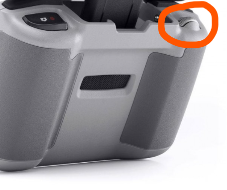
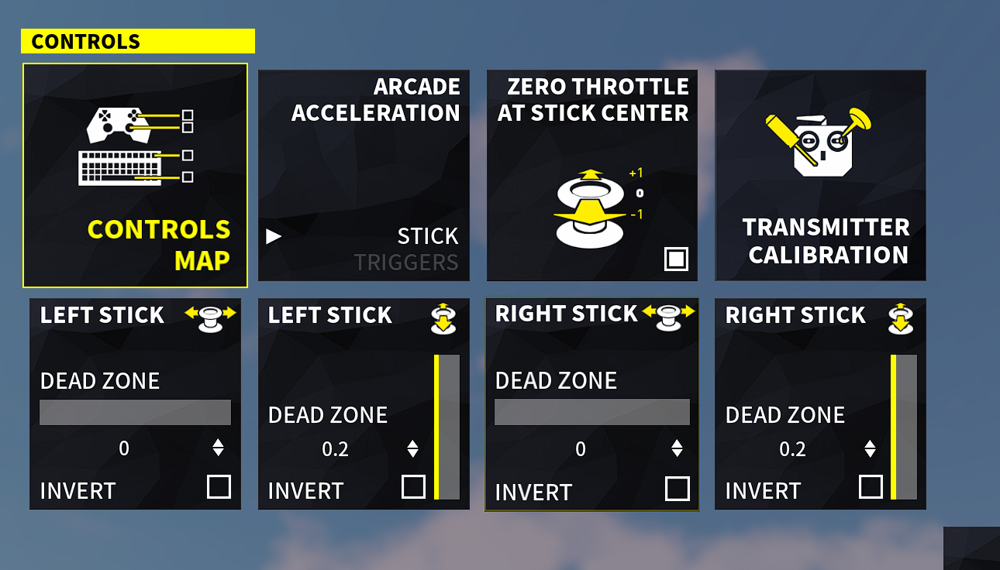

DJI RC-N1
===============
Live support: https://t.me/DJI_RC_N1_SIMULATOR_FLY_DC

Donate:

- https://send.monobank.ua/jar/87uNmHPh5v
- https://www.buymeacoffee.com/ivanyakymenko 

-----------------------------------------------------------------------------
Latest version V3.1.0 (21.10.2023)
 - Fixed the existing errors:
   - Fixed `NameError: name 's' is not defined. Did you mean: 'st'?` -> Checked if the com port was opened, else it will throw error and exit
   - Fixed `NameError: name 'camera' is not defined` -> moved it into the `st` dict
 - Added an option to use vJoy as driver
 - Upgraded the command arguments:
   - Now actually using the `--port` argument. The script will search for the correct port if you leave `--port` argument away, else it will try to open the port you supplied
   - Added `--driver` for selecting if you want to use `vgamepad` or `vjoy`
   - Added `--device` (`-d`) for selecting vJoy device (if using `vjoy` as `--driver`)
   - Added `--invert` (`-i`) for telling the software which inputs it should invert
 - Changed the CAM slider to release buttons when its value is inbetween the checked values (instead of when the slider is at 0)
 - Added error messages for when packages are missing. These messages include the command to install the missing package.
-----------------------------------------------------------------------------

 - Connect your DJI Remote Controller to your PC and use it to play simulators
 - Confirmed DJI Mavic 3 RC231
 - Confirmed DJI Mini 3 RC-N1
 - For Mavic Mini or a Python interface, take a look at [justin97530/miniDjiController](https://github.com/justin97530/miniDjiController)
 - For DJI Mini 2 or a Python interface, take a look at [usatenko/DjiMini2RCasJoystick](https://github.com/usatenko/DjiMini2RCasJoystick)
 - For DJI Phantom 3 take a look at [mishavoloshchuk/mDjiController](https://github.com/mishavoloshchuk/mDjiController)
-----------------------------------------------------------------------------

This is a program that connects to your DJI Mavic 3 Remote Controller (RC-N1) as a XBox360 gamepad,
reads the stick positions and tells Windows that position.

-----------------------------------------------------------------------------
Installation / Usage
- Install packages/software before usage:
  - [dji-assistant-2-consumer-drones-series](https://www.dji.com/downloads/softwares/dji-assistant-2-consumer-drones-series) and close it after installation
  - [python](https://www.python.org/) 3.9 or 3.x
  - pyserial -> Install it using this command: `pip3 install pyserial` (or `pip install pyserial` if your system doesn't have python2 as well)
  - a virtual joystick library:
    - If you want to use vGamepad (easiest) run this command: `pip3 install vgamepad` (This will ALSO install the required driver)
    - If you want to use vJoy run this command: `pip3 install vjoy` (This will NOT install the required driver, download it from https://github.com/njz3/vJoy/)

- Power on your RC-N1
- Connect your controller via the bottom type-C USB
- Wait for around 5 seconds
- Run the `main.py` file
  - When using `vgamepad`, you can just run `python3 main.py`
  - When using `vjoy`, you'll have to run `python3 main.py --driver vjoy` (if you want to use a different device ID, add ` --device <index>` to the end)
  - Note: It is most likely that this script will tell you `Couldn't find the COM port`, this is because the description of the controller is not correctly read by windows (or the controller has doesn't tell it).
    If this is the case, you can tell the script to use the correct COM port instead. For this you will need to look up the correct COM port ID and add `-p <PORT_ID>` to the end of the command you're running. *`<PORT_ID>` looks like `COM3`*
    For finding the COM port ID you must unplug your controller, open 'Device Manager', go to 'Ports (COM & LPT)' and plug in your controller and device manager should update and show you the newly added COM ports.
    You need to use the FIRST COM port ID of those newly added devices. It should look like `COM3` where 3 can be any number.
  - To see all the available arguments, run `python3 main.py --help`
- Run your simulator

for restart game or recover drone: use camera wheel, left scroll

TROUBLESHOOTING
-----------------------------------------------------------------------------
App searching by itself for the serial port with description "DJI USB VCOM For Protocol"
make sure your device attached via bottom Type-C connector

[Tested with DCL - The game](https://store.steampowered.com/app/964570/DCL__The_Game/) 

    Preset:
    Mode 2
    Acro
    Zero throttle at stick center

